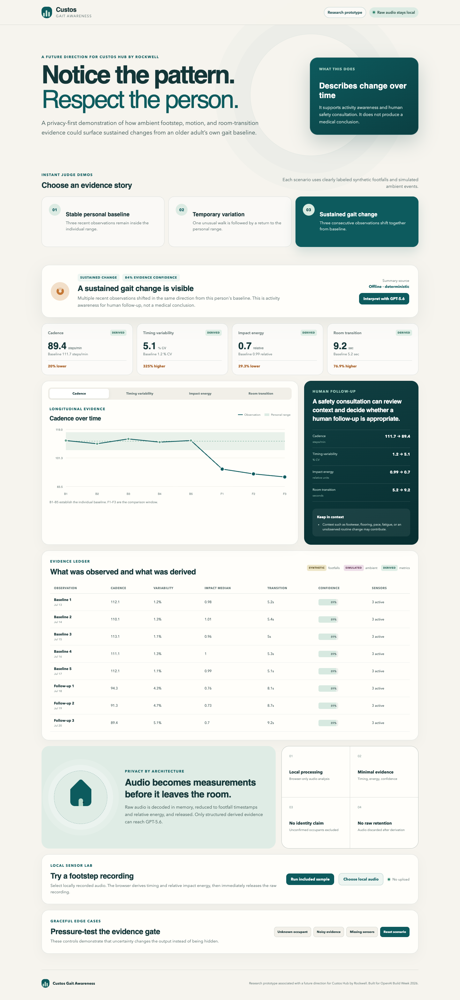

# Custos Gait Awareness

Custos Gait Awareness is a privacy-preserving multimodal gait-change awareness research prototype built for OpenAI Build Week 2026 in the **Apps for Your Life** category.

It demonstrates how locally processed footstep audio, simulated motion events, and simulated room transitions could establish an older adult's personal baseline, distinguish an isolated variation from a sustained change, and use GPT-5.6 to turn validated longitudinal evidence into a concise safety-consultation summary.

> This is a research prototype associated with a future direction for **Custos Hub by Rockwell**. It provides gait-change and activity awareness for human follow-up. It is not a production or medical device and does not produce medical conclusions.



## Judge quick start

Requirements: Node.js 22 or newer and npm.

```bash
npm install
npm run dev
```

Open `http://localhost:4173`, then:

1. Click **Stable personal baseline**.
2. Click **Temporary variation** and confirm that one unusual observation does not become a sustained change.
3. Click **Sustained gait change** and inspect the four contributing measurements.
4. Under **Local sensor lab**, click **Run included sample** to derive footfall timing and relative impact energy in the browser.
5. Under **Graceful edge cases**, try unknown occupant, noisy evidence, and missing sensors.

The full seeded demonstration works offline after dependencies are installed. No credential, account, hardware, or external dataset is required.

For a production-style local run:

```bash
npm run judge
```

Then open `http://127.0.0.1:8787`.

## What the prototype measures

| Evidence | Data type | Derivation | Purpose |
|---|---|---|---|
| Footfall timestamps | Measured for local uploads; synthetic for seeded demos | Local energy-envelope peak detection | Cadence and step intervals |
| Relative impact energy | Measured for local uploads; synthetic for seeded demos | Per-footfall energy distribution | Distribution shift, not force or weight |
| Motion events | Simulated | Event count and confidence | Context and sensor agreement |
| Room transitions | Simulated | Completion time minus start time | Contextual movement duration |
| Gait features | Derived | Deterministic TypeScript functions | Personal baseline and comparison |
| Human-readable summary | GPT-5.6 or deterministic offline fallback | Validated structured evidence only | Safety-consultation follow-up |

The UI continuously labels **measured**, **derived**, **simulated**, and **synthetic** evidence. It never presents synthetic data as a real person or a field result.

## Baseline and sustained-change logic

- Five confident, occupant-confirmed observations establish the personal baseline.
- Each metric is compared with that person's baseline using a conservative combination of relative, absolute, and baseline-variability thresholds.
- An isolated anomaly is retained as context but does not trigger follow-up.
- A sustained change requires three consecutive recent observations with at least two measurements shifting beyond threshold in a consistent pattern.
- Unknown occupants are excluded. Low-confidence evidence produces an uncertainty state. Missing sensors are visible and remaining sensors are reweighted only when evidence stays adequate.
- No population norm or medical threshold is used.

## Meaningful GPT-5.6 integration

The app uses the OpenAI Responses API with model `gpt-5.6` and strict structured output:

1. The browser sends only whitelisted derived features, the deterministic awareness state, and baseline summaries.
2. The server validates the request with Zod and explicitly rejects extra fields.
3. GPT-5.6 explains which measurements changed, preserves uncertainty, and suggests a human follow-up step.
4. A second grounding gate rejects a response if it changes the deterministic state, cites unavailable or altered values, or introduces unsupported health conclusions.
5. API failure returns the app to a clearly labeled deterministic offline summary.

The implementation follows the official [Structured Outputs guide](https://developers.openai.com/api/docs/guides/structured-outputs) and uses the documented [`gpt-5.6` alias](https://developers.openai.com/api/docs/models/gpt-5.6-sol).

Live GPT mode is optional for local development. Copy `.env.example`, supply a server-only OpenAI credential, and restart the app. Never place the credential in browser code or commit the local `.env` file. OpenAI API usage may incur charges; the offline demo does not.

## Privacy model

- Raw audio is decoded in browser memory only.
- Raw audio is not uploaded, written to storage, placed in application state, or persisted.
- Only footfall timestamps, relative energy values, derived features, confidence, and provenance can cross the GPT boundary.
- The app writes no cookies, `localStorage`, or `sessionStorage` entries.
- Seeded observations contain no PII and do not represent a real client.
- The repository contains no production Rockwell integrations, client data, or secrets.

See [Privacy Model](docs/PRIVACY.md), [Architecture](docs/ARCHITECTURE.md), and [Security](SECURITY.md).

## Tests and verification

```bash
npm run check
```

The deterministic suite covers:

- cadence, variability, energy distribution, and transition calculations;
- multi-observation baseline construction and insufficient data;
- stable, isolated, and sustained-change classification;
- missing sensors, noisy evidence, and unknown occupants;
- local footfall peak detection and flat-signal rejection;
- privacy-safe GPT payload construction;
- structured-output schema, evidence grounding, and unsupported-conclusion rejection.

See [Validation Record](docs/VALIDATION.md) for command results and browser coverage.

## Project structure

```text
src/
  components/       Accessible dashboard and local audio UI
  lib/              Feature, baseline, change, privacy, and summary logic
server/             Server-side GPT-5.6 boundary and static app host
public/             Self-generated synthetic audio sample and icon
scripts/            Reproducible synthetic audio generator
docs/               Contest, research, privacy, architecture, and demo package
```

## Codex collaboration and Build Week provenance

This standalone project was created during the official submission period on July 16, 2026. It did not exist before Build Week and is separate from production Rockwell repositories and services.

**Jose decided:**

- the product boundary: gait-change awareness and human follow-up, with no medical conclusion;
- the privacy boundary: local raw-audio processing and derived-feature-only retention;
- the Rockwell language, audience, Custos Hub relationship, and $150 Home Safety and Readiness Audit as the future service entry point;
- the hard stop against public deployment, repository publication, video upload, or Devpost submission without his approval.

**Codex accelerated:**

- official-rule and current GPT-5.6 API research;
- architecture, deterministic feature math, baseline comparison, and sustained-change logic;
- the complete React dashboard and local audio path;
- GPT structured-output integration and evidence-rejection guardrails;
- deterministic tests, browser verification, privacy/security review, licensing review, and contest packaging.

**Evidence of work:**

- dated Git history begins during the submission period;
- this primary Codex task contains the majority of core implementation work;
- [Decision Log](docs/DECISIONS.md) separates Jose's decisions from Codex execution;
- the final submission must include the `/feedback` Session ID from this task.

## Contest package

- [Architecture](docs/ARCHITECTURE.md)
- [Privacy Model](docs/PRIVACY.md)
- [Limitations](docs/LIMITATIONS.md)
- [Research Basis](docs/RESEARCH.md)
- [Licenses and Data Provenance](docs/LICENSES.md)
- [Troubleshooting](docs/TROUBLESHOOTING.md)
- [Under-three-minute Demo Script](docs/VIDEO_SCRIPT.md)
- [Devpost Draft](docs/DEVPOST_DRAFT.md)
- [Submission Checklist](docs/SUBMISSION_CHECKLIST.md)
- [Validation Record](docs/VALIDATION.md)

## Future Rockwell direction

If this research direction advances, the appropriate first human step would remain a **$150 Home Safety and Readiness Audit**, followed by a safety consultation about whether Custos Hub by Rockwell is appropriate. No such service or gait-awareness capability is represented here as currently deployed.

## License

The project code is available under the [MIT License](LICENSE). The OpenAI SDK is Apache-2.0; the other direct runtime dependencies are MIT. The included audio sample and icon were generated specifically for this project. See [Licenses and Data Provenance](docs/LICENSES.md).
