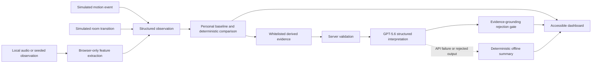

# Architecture

## Design choice

Custos Gait Awareness uses a React/TypeScript single-page application plus a small Express server. The browser owns audio decoding and deterministic gait math. The server owns the OpenAI credential, request validation, and GPT-5.6 structured-output call.

This is intentionally smaller than the production Rockwell stack. It is a contest prototype with no database, auth system, cloud storage, production API, or hardware dependency.

## Data flow

Raw audio stops at browser-only extraction and never enters the structured observation, server request, or GPT path.

## Key modules

| Module | Responsibility |
|---|---|
| `src/lib/audio.ts` | Browser audio envelope and candidate footfall detection |
| `src/lib/features.ts` | Cadence, interval variability, impact distribution, transition duration, confidence |
| `src/lib/baseline.ts` | Five-observation personal baseline |
| `src/lib/assessment.ts` | Stable, isolated, sustained, insufficient, low-confidence, and unknown-occupant states |
| `src/lib/api.ts` | Explicit derived-evidence allowlist |
| `src/lib/summary.ts` | GPT schema, grounding checks, prohibited-conclusion check, offline summary |
| `server/index.ts` | Server request boundary, Responses API, static production host |

## Failure behavior

| Failure | Result |
|---|---|
| Fewer than five baseline observations | Insufficient-data state; no comparison |
| Unknown occupant | Observation excluded from personal comparison |
| Noisy recent sensors | Low-confidence state; no gait-change interpretation |
| Missing sensor with adequate remaining evidence | Visible missing sensor; remaining confidence reweighted |
| Audio with fewer than four footfalls | No observation created |
| GPT unavailable | Deterministic offline summary remains active |
| GPT schema mismatch | Response rejected |
| GPT changes evidence values or state | Response rejected |
| GPT introduces unsupported health language | Response rejected |

## Deployment boundary

No public deployment has been performed. `npm run judge` builds the browser bundle and serves it from the same local Express process as the API, which is sufficient for local judging and later deployment to a Node-compatible host after Jose's approval.
